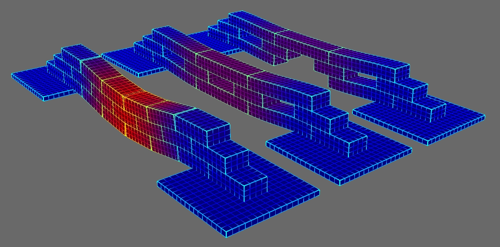
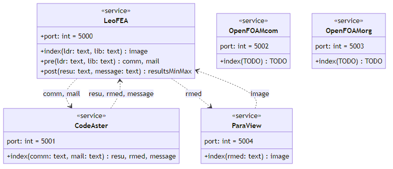

# **CADdrive Python** Modules

This repository contains the **CADdrive Python Modules**. The modules include two **applications**, namely LeoFEA and LeoVR, for running and visualizating finite element simulations. Furthermore, the repository contains several **services** for running finite element method (FEM) and computational fluid dynamics (CFD) simulations. Finally, the applications and services are based on a custom Python **package** providing common functionalities.

## ⚙ Modules

In this repository, we distinguish three types of modules:

- **Applications** for end-users.
- **Services** for application developers.
- **Packages** for service and application developers.

### Applications

This repository contains to end-user applications:

- **LeoFEA** for running finite element analysis.
- **LeoVR** for visualizing the results of finite element analysis.

#### LeoFEA ([read more](./applications/leofea/))

This application runs finite element simulations.

*Screenshot coming soon.*

#### LeoVR ([read more](./applications/leovr/))

This application visualizes the results of finite element simulation.



### Services

The following diagram provides and overview of the services and their interaction.



Here you can read more about the individual services:

* [CodeAster](./services/codeaster/)
* [OpenFOAM](./services/openfoam/)
* [ParaView](./services/paraview/)
* [LeoFEA](./services/leofea/)

### Packages

The packages provide common functionality for the applications and services.

* [CADdrive Python SDK](./packages/caddrive/)

## 👩‍💻 Guides

Install **CADdrive Python SDK** on your local computer:

```sh
pip install -e ./packages/caddrive
```

Run the **CADdrive Python Services** with Docker:

```sh
docker-compose up
```

## 📄 Documents

* [License](./LICENSE.md)
* [Changelog](./CONTRIBUTING.md)
* [Contributing](./CONTRIBUTING.md)